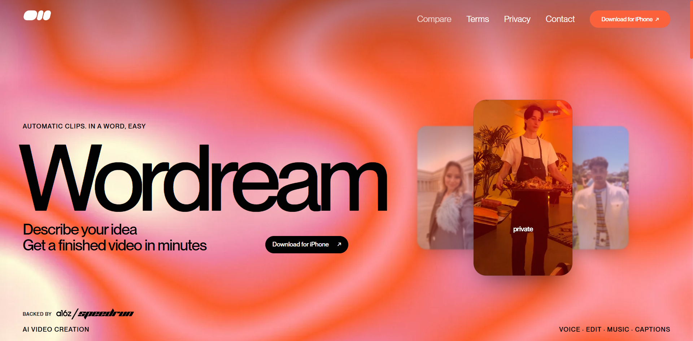
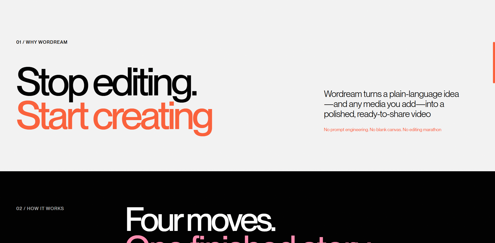
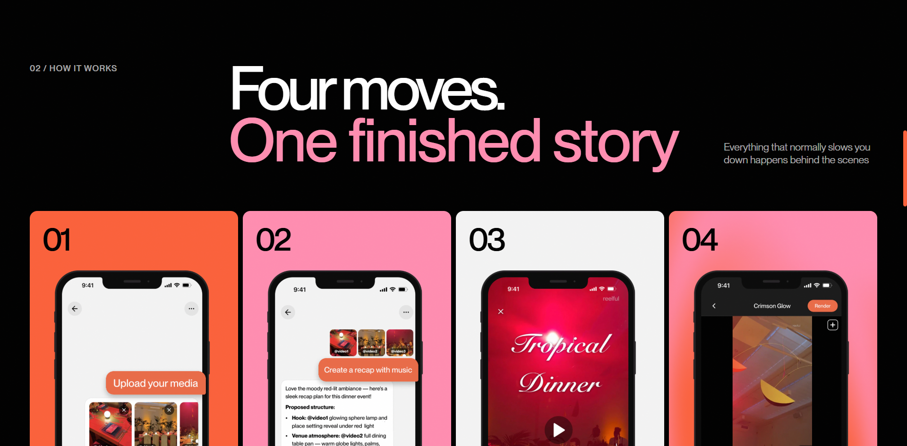
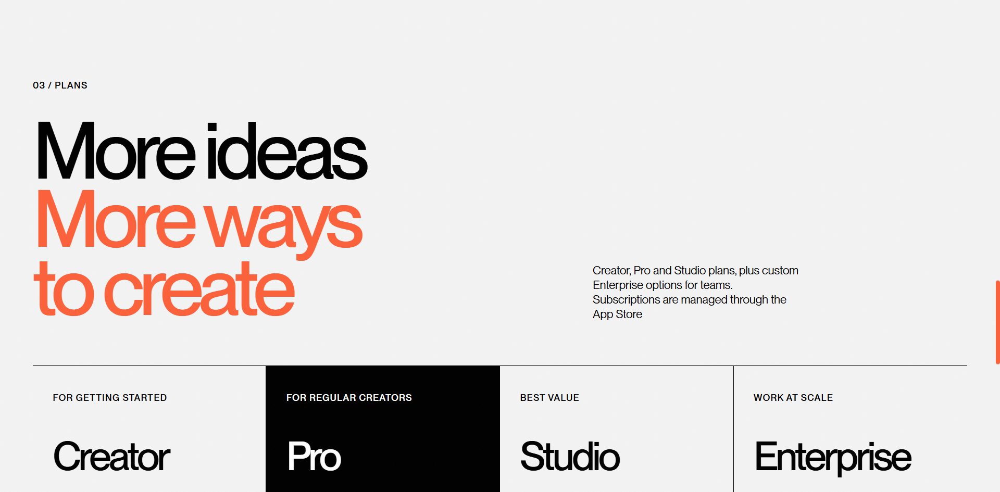
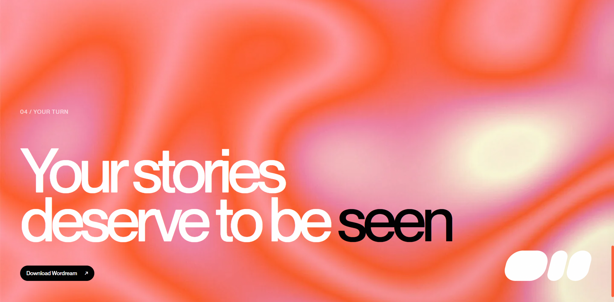
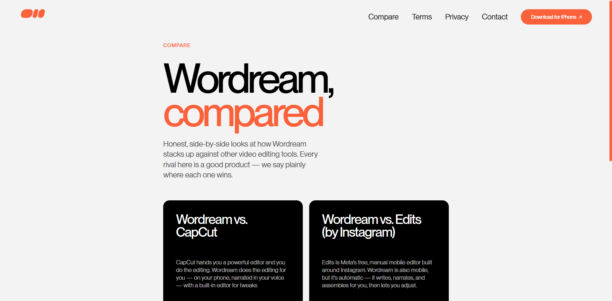

<div align="center">

# Wordream

**Prompt-to-Video AI Creator for iPhone**

Describe a video in plain words. Get a finished, ready-to-share clip in minutes.

[wordream.com](https://wordream.com) · [Compare](https://wordream.com/compare) · [Contact](https://wordream.com/contact)

</div>

---

<div align="center">
  
</div>

## Overview

This repository contains the official **Wordream** marketing site — the landing page, competitor comparisons, and legal pages for the Wordream iPhone app.

Wordream turns a plain-language idea into a polished video: the AI drafts the structure and script, builds the edit with motion, text, music and voiceover, and lets you refine everything through chat or a timeline editor before export.

**Live site: [wordream.com](https://wordream.com)**

## Screenshots

| Hero | Why Wordream |
|:---:|:---:|
|  |  |
| **How it works** | **Plans** |
|  |  |
| **Final CTA** | **Compare** |
|  |  |

## Tech Stack

- **[Astro 7](https://astro.build)** — static site generation, zero JS by default
- **[Tailwind CSS v4](https://tailwindcss.com)** — design tokens & utilities
- **[GSAP 3.15](https://gsap.com)** — hero entrance timeline, scroll parallax, section reveals, magnetic buttons
- **[Lenis](https://lenis.darkroom.engineering)** — smooth scrolling (desktop pointer devices only, respects reduced-motion)

## Features

**Motion & interaction**

- Hero entrance timeline with staged reveals
- Scroll-linked parallax on the hero section
- In-view section reveals (`once` semantics, no layout shift)
- Magnetic hover effect on primary CTAs
- Showcase carousel: tap the active card to unmute, swipe on touch devices, videos pre-seek their first frame, full `aria` state sync

**Scrollbar system**

- Desktop pointer devices: native scrollbar hidden, custom ember-colored scrollbar rendered in-app
- Touch devices: native thin scrollbar themed ember

**SEO & social**

- JSON-LD (`SoftwareApplication` on the home page, `Article` on comparison pages)
- Open Graph & Twitter card with dedicated og:image
- Canonical URLs, PWA manifest, theme color

**Accessibility**

- `prefers-reduced-motion` short-circuits all entrance animations and smooth scrolling
- Keyboard focus styles, aria-live carousel labels, semantic landmarks

## Pages

| Path | Content |
|---|---|
| `/` | Hero · Why · How it works · Plans · CTA |
| `/compare` | Comparison hub |
| `/compare/reelful-vs-capcut` | Wordream vs. CapCut |
| `/compare/reelful-vs-edits` | Wordream vs. Edits (by Instagram) |
| `/compare/reelful-vs-captions` | Wordream vs. Captions |
| `/compare/reelful-vs-mcp-editors` | Wordream vs. video-editing MCPs |
| `/terms` | Terms of Service |
| `/privacy` | Privacy Policy |
| `/contact` | Contact |

## Getting Started

```sh
bun install
bun dev        # http://localhost:4321
bun build      # outputs to ./dist
bun preview    # preview the production build
```

## Deployment

The site is hosted on **Vercel** — every push to `master` triggers an automatic deployment.

DNS is managed by Cloudflare (DNS-only mode). The custom scrollbar, font preloading and caching headers behave exactly as they do on other Vercel-hosted static sites.

## Roadmap

- [ ] Replace App Store placeholder links once the app ships
- [ ] Analytics: GA4, Meta Pixel, Microsoft Clarity
- [ ] Attribution: OneLink with UTM parameters

## License

© 2026 Wordream. All rights reserved.

---

<div align="center">
  <sub>Automatic clips. In a word, easy.</sub>
</div>
